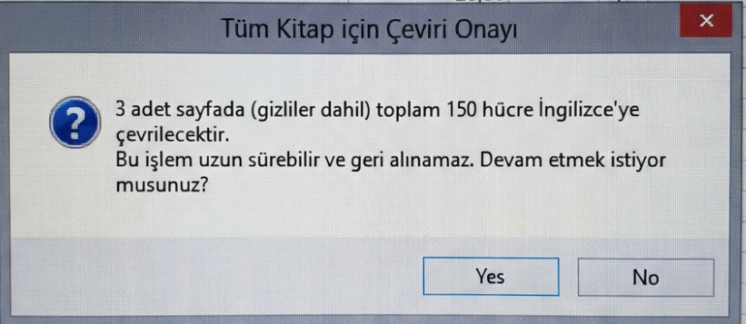

# 🌐 DeepL Excel Translator (VBA)


[Türkçe](#türkçe) | [English](#english)

---

<a name="türkçe"></a>
## 🇹🇷 Türkçe

Bu proje, Microsoft Excel çalışma kitaplarındaki içeriği **DeepL Free API** kullanarak otomatik olarak **belirlenen hedef dile (Varsayılan: İngilizce)** çeviren gelişmiş bir VBA makrosudur.

> [!WARNING]
> **Önemli:** Bu işlem **geri alınamaz** (Undo yapılamaz). Lütfen makroyu çalıştırmadan önce Excel dosyanızın bir yedeğini aldığınızdan emin olun.

### 🚀 Özellikler

*   **Kapsamlı Çeviri:** Çalışma kitabındaki **tüm sayfaları** (gizli sayfalar dahil) tarar ve çevirir.
*   **Yüksek Performans (Batch Processing):** Hücreleri tek tek göndermek yerine **50'li paketler** halinde API'ye gönderir. Bu sayede işlem hızı maksimize edilir ve API limitlerine takılma riski azalır.
*   **Akıllı Filtreleme:** Sayısal değerleri, tarihleri ve boş hücreleri atlar; sadece metin içeren hücreleri çevirir.
*   **Durum Takibi:** İlerleme durumu, Excel'in sol alt köşesindeki **Status Bar (Durum Çubuğu)** üzerinden anlık olarak takip edilebilir.
*   **Ücretsiz API Desteği:** DeepL'in ücretsiz (Free) API planı ile tam uyumlu çalışacak şekilde yapılandırılmıştır.


### 🛠️ Gereksinimler

1.  **Microsoft Excel:** Makroları çalıştırabilen herhangi bir masaüstü sürümü.
2.  **DeepL API Anahtarı:** DeepL üzerinden alınmış ücretsiz bir API anahtarı.
    *   Anahtar almak için: [DeepL API Signup](https://www.deepl.com/pro-api) (Free planı seçebilirsiniz).

### 📥 Kurulum ve Kullanım

1.  **Geliştirici Sekmesini Etkinleştirin (Eğer açık değilse):**
    *   `Dosya` > `Seçenekler` > `Şeridi Özelleştir` yolunu izleyin.
    *   Sağ taraftaki listeden **Geliştirici** kutucuğunu işaretleyin ve Tamam'a tıklayın.

2.  **VBA Editörünü Açın:**
    *   Excel dosyanızı açın ve `ALT` + `F11` tuşlarına basın.

3.  **Kodu Projeye Ekleyin:**
    *   VBA penceresindeki üst menüden **`Insert`** > **`Module`** seçeneğine tıklayın.
    *   İndirdiğiniz `DeepL_Translator.bas` dosyasını bir metin editörüyle (Notepad vb.) açın, tüm içeriği kopyalayın ve Excel'de açılan bu boş modül sayfasına yapıştırın.

4.  **API Anahtarınızı Tanımlayın:**
    *   Yapıştırdığınız kodun en üst satırlarında şu kısmı bulun:
        ```vba
        apiKey = "*****---------API_KEY_BURAYA_GELECEK---------******"
        ```
    *   Eşittir işaretinden sonraki tırnak içindeki uzun yazıyı silin ve **tırnak işaretlerini silmeden** arasına kendi DeepL API anahtarınızı yapıştırın.
    *   **Doğru Örnek:** `apiKey = "d4323...:fx"`
    *   *(Yanlış Örnek: `apiKey = d4323...:fx` -> Tırnak işareti olmazsa hata alırsınız!)*

5.  **Çeviriyi Başlatın:**
    *   Klavyenizden **`F5`** tuşuna basarak makroyu hemen çalıştırabilirsiniz.
    *   **Alternatif:** Excel ekranına dönüp **Geliştirici** > **Makrolar** butonuna tıklayın, listeden makro adını seçip **Çalıştır**'a basın.
    *   Güvenlik uyarısını okuyun ve **"Evet"** butonuna basarak çeviriyi başlatın.

    

6.  **Hedef Dili Değiştirme (İsteğe Bağlı):**
    *   Kodun içerisinde en aşağılara doğru inin (yaklaşık 121. satır civarı) ve şu kısmı bulun:
        ```vba
        requestBody = requestBody & "], ""target_lang"": ""EN""}"
        ```
    *   `"EN"` kısmını istediğiniz dil koduyla değiştirin (Örn: Türkçe için `"TR"`, Almanca için `"DE"`, İspanyolca için `"ES"`).

### ❓ Sık Karşılaşılan Hatalar (Troubleshooting)

*   **Hata 403 (Forbidden):** API anahtarınız yanlıştır. Lütfen DeepL panelinden anahtarınızı kopyalayıp koda doğru yapıştırdığınızdan emin olun.
*   **Hata 429 veya 456 (Quota):** Ücretsiz API kotanız (aylık 500.000 karakter) dolmuştur. Bir sonraki ayı beklemeniz veya Pro sürüme geçmeniz gerekir.

---

<a name="english"></a>
## 🇺🇸 English

This project is an advanced VBA macro that automatically translates content in Microsoft Excel workbooks to **the defined target language (Default: English)** using the **DeepL Free API**.

> [!WARNING]
> **Important:** This process **cannot be undone**. Please make sure to backup your Excel file before running the macro.

### 🚀 Features

*   **Comprehensive Translation:** Scans and translates **all sheets** in the workbook (including hidden sheets).
*   **High Performance (Batch Processing):** Sends cells to the API in **batches of 50** instead of one by one. This maximizes processing speed and reduces the risk of hitting API limits.
*   **Smart Filtering:** Skips numerical values, dates, and empty cells; translates only cells containing text.
*   **Status Monitoring:** Progress can be monitored in real-time via the **Status Bar** at the bottom left corner of Excel.
*   **Free API Support:** Configured to work fully compatible with DeepL's Free API plan.


### 🛠️ Requirements

1.  **Microsoft Excel:** Any desktop version capable of running macros.
2.  **DeepL API Key:** A free API key obtained from DeepL.
    *   To get a key: [DeepL API Signup](https://www.deepl.com/pro-api) (You can choose the Free plan).

### 📥 Installation and Usage

1.  **Enable Developer Tab (If not already enabled):**
    *   Go to `File` > `Options` > `Customize Ribbon`.
    *   Check the **Developer** box in the list on the right and click OK.

2.  **Open VBA Editor:**
    *   Open your Excel file and press `ALT` + `F11`.

3.  **Add the Code:**
    *   Click `Insert` > `Module` from the menu in the VBA window.
    *   Copy the entire content of the `DeepL_Translator.bas` file and paste it into this new empty module.

4.  **Enter API Key:**
    *   Find the following line at the top of the code:
        ```vba
        apiKey = "*****---------API_KEY_BURAYA_GELECEK---------******"
        ```
    *   Delete the placeholder text inside the quotes and paste your actual DeepL API key.
    *   Example: It should look like `apiKey = "d4f...:fx"`.

5.  **Run the Macro:**
    *   Press `F5` on your keyboard **or**
    *   Go back to Excel, click `Developer` > `Macros`, select `TumKitabiIngilizceyeCevir_FreeAPI` from the list, and click `Run`.
    *   Click "Yes" on the **confirmation dialog** to start the translation.

    

6.  **Changing Target Language (Optional):**
    *   Scroll down to the bottom of the code (approx. line 121) and find this line:
        ```vba
        requestBody = requestBody & "], ""target_lang"": ""EN""}"
        ```
    *   Change `"EN"` to your desired language code (e.g., `"TR"` for Turkish, `"DE"` for German, `"ES"` for Spanish).

### ❓ Troubleshooting

*   **Error 403 (Forbidden):** Your API Key is invalid. Please copy the key correctly from your DeepL account.
*   **Error 429 or 456 (Quota):** You have exceeded the free monthly limit (500,000 characters). You need to wait for the next month or upgrade to Pro.

---

## 📄 License

This project is licensed under the MIT License - see the LICENSE file for details.
